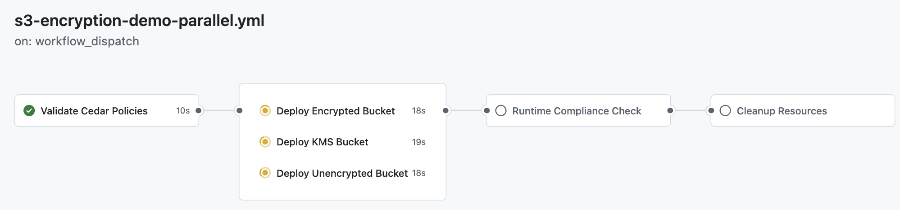

# End-to-End Authorization with Cedar: Shift-Left to Shift-Right

Something that might keep you up at night: permission misconfigurations. I've been in this industry long enough to see countless security breaches that started with an overly permissive `"*"` hiding in production. But here's what really gets me excited—Cedar solves this problem from both ends of the development lifecycle.

Today, I want to show you how [Cedar](https://aws.amazon.com/about-aws/whats-new/2023/05/cedar-open-source-language-access-control/) fundamentally changes the authorization game by being both a shift-left tool (catching issues during development) AND a shift-right solution (making runtime decisions with the same policies). While Cedar is an open-source policy language, it's specifically optimized for AWS environments through [Amazon Verified Permissions](https://aws.amazon.com/verified-permissions/), giving you enterprise-grade authorization without the infrastructure headaches.

## The Authorization Problem Nobody Talks About

Picture your typical enterprise application. You need to control access based on:
- User attributes (department, role, clearance level)
- Resource properties (classification, environment, owner)
- Contextual factors (time of day, location, request origin)

Most teams end up with what I call "authorization spaghetti"—business logic scattered across the codebase, impossible to test comprehensively, and terrifying to modify. I've seen companies where changing a simple permission rule requires touching 20 different files and hoping nothing breaks.

But here's the real killer: even if you test your authorization logic during development, the runtime implementation often differs. Different code, different logic, different bugs.

## Enter Cedar: One Policy Language, End-to-End

Cedar represents a paradigm shift. While Cedar is an open-source policy language that can be used anywhere, it's specifically optimized for AWS environments through Amazon Verified Permissions—a fully managed service that makes Cedar production-ready at scale.

You write your authorization policies once, and they work identically in:
- Local development testing
- CI/CD pipeline validation
- Runtime authorization decisions (via Amazon Verified Permissions)
- Audit and compliance reporting

```cedar
// Only operations team can write to encrypted S3 buckets
permit (
  principal,
  action == Action::"s3:PutObject",
  resource
)
when {
  principal.department == "operations" &&
  resource.encryption_enabled == true
};
```

This same policy gets:
- **Tested** during development (shift-left)
- **Validated** in your CI/CD pipeline (shift-left)
- **Enforced** at runtime in production (shift-right)
- **Audited** in your security logs (shift-right)

## The Architecture That Changes Everything

Here's how Cedar transforms your entire authorization lifecycle:

```
Traditional Approach:
Dev: Write auth logic → Test: Hope it works → Runtime: Different implementation
(Inconsistent, error-prone, untestable)

Cedar Approach:
Dev: Write policy → Test: Validate same policy → Runtime: Execute same policy
(Consistent, reliable, testable)
```

### The Shift-Left Benefits

During development and CI/CD:
- **Immediate Feedback**: Validate policies in milliseconds
- **Comprehensive Testing**: Run thousands of scenarios before deployment
- **Security Scanning**: Catch overly permissive rules automatically
- **Version Control**: Track every policy change in Git

### The Shift-Right Benefits

During runtime and operations:
- **Consistent Enforcement**: Same policies from dev to production
- **Performance**: Sub-millisecond authorization decisions
- **Observability**: Every decision logged with reasoning
- **Dynamic Updates**: Change policies without redeploying code

## Real-World Example: S3 Encryption Enforcement

Let me show you exactly how Cedar works end-to-end with a concrete S3 encryption compliance scenario that matches AWS Config Rule `s3-bucket-server-side-encryption-enabled`:

### The Cedar Policy

This single policy enforces S3 encryption across your entire development lifecycle:

```cedar
// AWS Config Rule: s3-bucket-server-side-encryption-enabled
// Implements both shift-left and shift-right validation

// ALLOW: Config Rule evaluation for compliant S3 buckets
permit(
  principal == ConfigEvaluation::"s3-bucket-server-side-encryption-enabled",
  action == Action::"config:EvaluateCompliance",
  resource
)
when {
  resource is S3Resource &&
  (resource.encryption_enabled == true &&
   resource has encryption_algorithm &&
   ["AES256", "aws:kms", "aws:kms:dsse"].contains(resource.encryption_algorithm))
};

// ALLOW: Create encrypted S3 buckets only
permit(
  principal,
  action == Action::"s3:CreateBucket", 
  resource
)
when {
  resource is S3Resource &&
  resource.encryption_enabled == true &&
  resource has encryption_algorithm &&
  ["AES256", "aws:kms", "aws:kms:dsse"].contains(resource.encryption_algorithm)
};

// ALLOW: CloudFormation template validation for encrypted buckets
permit(
  principal,
  action == Action::"cloudformation:ValidateTemplate",
  resource
)
when {
  resource is CloudFormationTemplate &&
  resource.has_encrypted_s3_resources == true
};
```

### Shift-Left: Local Development & CloudFormation Validation

**1. Local Testing with Real CloudFormation Templates**

You validate CloudFormation templates against the Cedar policy above before committing:

```bash
# Test encrypted bucket template against Cedar policy (should PASS)
./scripts/validate-cloudformation-s3.sh examples/cloudformation/s3-encrypted-bucket.yaml

# Test unencrypted bucket template against Cedar policy (should FAIL)  
./scripts/validate-cloudformation-s3.sh examples/cloudformation/s3-unencrypted-bucket.yaml
```

The script parses your CloudFormation template, extracts S3 encryption settings, creates Cedar entities, and validates:

```yaml
# examples/cloudformation/s3-encrypted-bucket.yaml
Resources:
  EncryptedBucket:
    Type: AWS::S3::Bucket
    Properties:
      BucketEncryption:
        ServerSideEncryptionConfiguration:
          - ServerSideEncryptionByDefault:
              SSEAlgorithm: AES256  # ✅ Cedar policy allows this
```

**2. Interactive Development Testing**

```bash
# Quick Cedar policy validation with test scenarios
./scripts/simple-s3-demo.sh

# Results show Cedar policy decisions:
# ✅ Creating encrypted bucket: ALLOWED  
# ❌ Creating unencrypted bucket: DENIED
```

### Shift-Left: CI/CD Pipeline Automation

**GitHub Actions Workflow validates every commit:**

Our CI/CD pipeline demonstrates Cedar's shift-left capabilities by running parallel validation jobs that test different S3 bucket encryption scenarios against the same Cedar policies used in production:



The workflow shows three parallel deployment jobs running simultaneously:
- **Deploy Encrypted Bucket** (18s): Tests AES256 encryption compliance
- **Deploy KMS Bucket** (19s): Tests AWS KMS encryption compliance  
- **Deploy Unencrypted Bucket** (18s): Validates that unencrypted buckets are properly denied

This parallel approach ensures comprehensive testing of all encryption scenarios while maintaining fast feedback loops for developers.

```yaml
name: S3 Encryption Policy Demo
on: [push, pull_request]

jobs:
  validate-policies:
    runs-on: ubuntu-latest
    steps:
      - uses: actions/checkout@v4
      - name: Validate Cedar policies
        run: |
          for policy_file in policies/*.cedar; do
            cedar validate --schema schema.cedarschema --policies "$policy_file"
          done
          
  # Parallel deployment jobs test different encryption scenarios
  deploy-encrypted-bucket:
    needs: validate-policies
    runs-on: ubuntu-latest
    steps:
      - name: Deploy AES256 encrypted bucket
        run: |
          aws cloudformation deploy \
            --template-file examples/cloudformation/s3-encrypted-bucket.yaml \
            --stack-name demo-encrypted-bucket
            
  deploy-kms-bucket:
    needs: validate-policies
    runs-on: ubuntu-latest
    steps:
      - name: Deploy KMS encrypted bucket
        run: |
          aws cloudformation deploy \
            --template-file examples/cloudformation/s3-kms-encrypted-bucket.yaml \
            --stack-name demo-kms-bucket
            
  deploy-unencrypted-bucket:
    needs: validate-policies
    runs-on: ubuntu-latest
    steps:
      - name: Test unencrypted bucket (should fail)
        run: |
          # This deployment should fail Cedar policy validation
          aws cloudformation deploy \
            --template-file examples/cloudformation/s3-unencrypted-bucket.yaml \
            --stack-name demo-unencrypted-bucket || echo "✅ Correctly denied unencrypted bucket"
```

**The pipeline catches issues before deployment:**
- Templates without encryption are flagged through parallel testing
- Policy syntax errors are caught immediately in the validation job
- Multiple encryption scenarios are tested simultaneously for comprehensive coverage
- Real CloudFormation deployments validate the actual AWS resources Cedar will protect

### Shift-Right: Runtime S3 Compliance

**1. Real S3 Bucket Compliance Checking**

Your application checks actual S3 buckets against the same Cedar policy:

```bash
# Check real S3 bucket compliance
./scripts/check-s3-bucket-compliance.sh my-production-bucket

# Results:
# Bucket: my-production-bucket
# Encryption: aws:kms with key arn:aws:kms:us-east-1:123:key/abc123
# ✅ Cedar compliance: COMPLIANT
```

**2. Automated GitHub Actions Demo**

The full GitHub Actions workflow demonstrates end-to-end validation:

```yaml
deploy-s3-buckets:
  steps:
    # Deploy encrypted bucket via CloudFormation
    - name: Deploy encrypted S3 bucket
      run: |
        aws cloudformation deploy \
          --template-file examples/cloudformation/s3-encrypted-bucket.yaml \
          --stack-name demo-encrypted-bucket
          
    # Check runtime compliance with Cedar
    - name: Runtime compliance check
      run: |
        BUCKET=$(aws cloudformation describe-stacks \
          --stack-name demo-encrypted-bucket \
          --query 'Stacks[0].Outputs[?OutputKey==`BucketName`].OutputValue' \
          --output text)
          
        # Same Cedar policy validates the deployed bucket
        ./scripts/check-s3-bucket-compliance.sh "$BUCKET"
```

### The Complete Flow in Action

**Day 1: Developer writes CloudFormation template**
```bash
# Local validation catches issues immediately
./scripts/validate-cloudformation-s3.sh my-new-template.yaml
# ❌ FAIL: No encryption found - Cedar would DENY
```

**Day 2: Developer adds encryption and commits**
```bash
git add examples/cloudformation/my-encrypted-bucket.yaml
git commit -m "Add encrypted S3 bucket template"
git push  # Triggers GitHub Actions validation
```

**Day 3: CI/CD validates and deploys**
```yaml
# GitHub Actions runs:
# ✅ Cedar policy validation: PASS
# ✅ CloudFormation template check: PASS  
# ✅ Deploy to AWS: SUCCESS
# ✅ Runtime compliance check: COMPLIANT
```

**Day 4: Production monitoring**
```bash
# Automated compliance checking
aws s3api list-buckets --query 'Buckets[].Name' --output text | \
  xargs -I {} ./scripts/check-s3-bucket-compliance.sh {}

# Results logged to CloudWatch for compliance reporting
```

### Why This Works So Well

**Same Policy, Multiple Contexts:**
- CloudFormation templates tested before deployment
- Real buckets validated after deployment  
- AWS Config Rules implemented with identical logic
- Compliance reports generated from the same policy

**Comprehensive Coverage:**
- AES256 encryption support
- AWS KMS encryption with key validation
- KMS DSSE (Dual-layer Server-Side Encryption)
- Policy-enforced encryption for legacy buckets

**Developer Experience:**
- Instant feedback during development
- Clear pass/fail results
- Real CloudFormation integration
- Automated CI/CD validation

*All the code examples in this post are available in the [working repository](https://github.com/PaulDuvall/cedar) where you can see the complete implementation, run the demos, and explore the test suites.*

## The Complete Authorization Lifecycle

Here's how Cedar works across your entire stack:

### 1. Local Development (Shift-Left)
- Write policies in your IDE with syntax highlighting
- Get immediate validation feedback
- Run unit tests against policies
- Simulate production scenarios locally

> **💡 IDE Tip**: For Cedar syntax highlighting, set your IDE to JavaScript language mode for `.cedar` files until native Cedar support is added.

### 2. CI/CD Pipeline (Shift-Left)
- Validate syntax on every commit
- Run comprehensive test suites
- Check for security anti-patterns
- Compare policies against compliance requirements
- Deploy validated policies to Amazon Verified Permissions

### 3. Runtime (Shift-Right)
- Execute policies through Amazon Verified Permissions
- Sub-millisecond performance at scale with AWS-optimized infrastructure
- Complete audit trail with decision reasoning in CloudWatch
- Real-time policy updates without restarts
- Deep integration with AWS services and SDKs

### 4. Operations & Monitoring (Shift-Right)
- Analyze authorization patterns in CloudWatch
- Identify anomalies and potential attacks
- Generate compliance reports from audit logs
- Optimize policies based on real usage
- Monitor performance metrics and costs

## Why This End-to-End Approach Matters

### Cedar + AWS: The Perfect Combination

While Cedar itself is open source, Amazon Verified Permissions provides the production-ready infrastructure optimized for AWS environments:

- **Managed Service**: No infrastructure to maintain
- **Deep AWS Integration**: Native integration with CloudTrail, CloudWatch, and IAM
- **AWS Optimization**: Designed to work well with AWS services and infrastructure
- **Global Scale**: AWS's infrastructure ensures low-latency decisions worldwide
- **High Availability**: Built-in redundancy and failover
- **Anti-Lock-in**: Cedar is open source—you can run it anywhere while benefiting from AWS optimization

### Consistency Eliminates Entire Classes of Security Vulnerabilities

Authorization bugs aren't just inevitable when you test one thing and deploy another—they're systematically dangerous because they're the hardest to catch and most expensive to fix. Traditional authorization testing only validates happy paths, while Cedar enables exhaustive negative case testing at development time. 

Cedar ensures what you test IS what runs in production. More importantly, it enables [mathematical proof](https://www.youtube.com/watch?v=Y2xAwDC_QIg) that your security model works before deployment. This isn't about consistency—it's about formal verification of your authorization logic.

### Performance With Mathematical Guarantees

Cedar's performance advantage isn't just about speed—it's about predictable evaluation complexity. Unlike custom authorization code that can have unbounded execution time, Cedar policies have bounded evaluation with formal complexity guarantees. This makes capacity planning and SLA compliance possible in ways that custom authorization logic cannot provide.

- Development: Instant feedback on policy changes with formal verification
- Runtime: Sub-millisecond authorization decisions with predictable performance
- Operations: Real-time visibility into every decision with complete audit trails

### Compliance Becomes Living Documentation

Cedar policies become living compliance documentation. Your SOC 2 auditor can read your actual authorization logic, not just documentation that might be outdated. This represents a fundamental shift from "compliance by documentation" to "compliance by implementation."

- **Mathematical proof** of authorization policies before deployment
- **Complete audit trail** of every runtime decision with reasoning
- **Version-controlled compliance** showing policy evolution over time
- **Readable policies** that auditors can verify directly against requirements

## Common Misconceptions Clarified

### "Cedar is Just Another Policy Language"

Cedar is a complete authorization ecosystem that spans your entire development and runtime lifecycle. One language, one set of policies, end-to-end consistency.

### "It's Only for Simple Rules"

Cedar handles complex, attribute-based policies with nested conditions, set operations, and hierarchical resources. The simplicity is in the consistency, not limitations.

### "Cedar is Just Like OPA (Open Policy Agent)"

This is the most important distinction to understand. While both are policy languages, they serve fundamentally different purposes:

**OPA's Strengths:**
- **General-purpose policy engine** - handles infrastructure, APIs, Kubernetes, CI/CD pipelines
- **Shift-left testing** - can validate CloudFormation templates and infrastructure-as-code
- **Mature ecosystem** - CNCF graduated project with extensive tooling

**Cedar's Critical Advantage:**
- **Seamless dev-to-production consistency** - the exact same policy that validates your CloudFormation template in development also makes runtime authorization decisions in production
- **Authorization-specific** - purpose-built for access control with formal verification capabilities
- **No translation layer** - OPA requires adapting your policies for different contexts; Cedar policies work identically across all contexts

**The Key Difference:**
With OPA, you might write one Rego policy to validate CloudFormation templates and a different implementation for runtime authorization. With Cedar, you write one policy once that works across your entire lifecycle - from local development through production runtime.

This isn't just about convenience - it's about mathematical certainty that your development-time validation and production-time enforcement are identical.

### "It Replaces IAM"

Cedar complements IAM perfectly. Use IAM for AWS service permissions, Cedar (via Amazon Verified Permissions) for application-level authorization. They work together beautifully—IAM secures your AWS resources, Cedar secures your application logic.

## Trade-offs to Consider

While Cedar's dev-to-production consistency offers significant benefits, it's important to understand the implementation challenges:

### Migration Investment (Not Just Costs)
- **Config Rules rewriting as debt reduction** - Your current Config Rules are scattered technical debt. Cedar migration transforms inconsistent, untestable rules into unified, version-controlled, testable policies
- **Custom integration as organizational capability** - Building integration scripts (like the `validate-cloudformation-s3.sh` examples) creates reusable organizational capabilities for shift-left security
- **Team training as competitive advantage** - Learning Cedar policy language and entity modeling elevates your organization's security engineering maturity

### Technical Complexity
- **Entity model complexity** - Different contexts (CloudFormation templates vs. runtime resources) require sophisticated data transformation
- **Integration overhead** - Building and maintaining bridges between Cedar and existing AWS services
- **Schema evolution** becomes more challenging when policies must work across multiple contexts

### Operational Considerations
- **Debugging complexity** increases when the same policy behaves differently across contexts
- **Testing requirements** expand significantly - you need comprehensive coverage for every context
- **Version synchronization** between development tools and production systems

### When This Approach Makes Sense
- **New projects** without existing Config Rules or authorization infrastructure
- **Organizations prioritizing consistency** over migration speed
- **Teams with resources** to build and maintain integration tooling
- **Complex authorization requirements** that benefit from unified policy management

### When to Consider Alternatives
- **Heavy investment in existing Config Rules** that work well
- **Simple compliance checks** that don't require sophisticated authorization logic
- **Resource-constrained teams** that can't invest in custom integration development
- **Legacy systems** that would be difficult to integrate with Cedar

## Anti-Patterns to Avoid

### Don't Split Your Authorization Logic

The whole point is consistency. Don't write Cedar policies for testing and different logic for runtime.

### Don't Bypass Cedar for "Performance"

Cedar is designed for performance with sub-millisecond decision times. Before building custom authorization logic for performance reasons, evaluate whether Cedar meets your requirements through Amazon Verified Permissions.

### Don't Forget to Test Negative Cases

Test what should be denied as thoroughly as what should be allowed. Cedar makes this easy.

## The Business Case for End-to-End Authorization

If you're pitching using Cedar with Amazon Verified Permissions to leadership, you might emphasize:

### Risk Reduction at Enterprise Scale
- **Eliminate entire categories of authorization bugs** through formal verification
- **Mathematically proven security models** before production deployment
- **Authorization bugs in production cost millions** (Equifax, Capital One, etc.) - Cedar eliminates these through shift-left validation
- **The ROI calculation isn't marginal** - it's often 100x+ for large organizations

### Developer Experience Revolution
- **No more "authorization mysteries"** - policies are readable and testable
- **No more deployment fear** - authorization changes are validated before deployment  
- **No more incident debugging** - every authorization decision is logged with reasoning
- **Authorization becomes a first-class engineering discipline** with proper tooling

### Organizational Security Maturity
- **Forces clear thinking about authorization** - modeling entities and actions reveals hidden assumptions
- **Creates organizational learning effects** - better security architecture emerges naturally
- **Transforms security from reactive to proactive** - catch issues at development time
- **Builds sustainable competitive advantage** in security and compliance

### Enterprise Economics
- Authorization complexity appears whether you manage it explicitly (Cedar) or implicitly (scattered code)
- Migration costs are one-time, authorization bugs are recurring
- Pay migration costs intentionally rather than security incident costs accidentally
- At enterprise scale, the economics become overwhelmingly favorable

#### What You'll Actually Pay
Amazon Verified Permissions uses simple, predictable pricing:
- **$1.50 per million authorization requests**
- **No minimum fees or upfront costs**

**Real-world examples:**
- Small app (100K requests/month): ~$0.15/month
- Medium app (1M requests/month): ~$1.50/month  
- Large app (10M requests/month): ~$15/month
- Enterprise (100M requests/month): ~$150/month

Compare this to building and maintaining your own authorization infrastructure—most teams spend more on a single engineer's time than they would on millions of authorization decisions.

## Your Implementation Roadmap

Here's your path to end-to-end Cedar authorization:

### Day 1: Foundation
- Map your current authorization patterns
- Design your entity and action model
- Write your first Cedar policies
- Set up local testing

### Day 2: Integration
- Add Cedar to your CI/CD pipeline
- Create comprehensive test suites
- Validate policies automatically
- Set up policy deployment

### Day 3: Runtime with Amazon Verified Permissions
- Deploy Cedar policies to Amazon Verified Permissions
- Configure your policy store with AWS-optimized settings
- Route authorization decisions through the managed service
- Enable CloudWatch integration for comprehensive logging
- Monitor performance metrics via AWS CloudWatch

### Day 4 and Beyond: Optimization
- Analyze authorization patterns
- Refine policies based on usage
- Expand to more use cases
- Build team expertise

## The Future of Authorization: An Evolutionary Step

Cedar represents more than a tool choice—it's an evolutionary step in how organizations approach authorization security. Traditional authorization is like writing assembly code: it works, but it's error-prone and unmaintainable. Cedar is like having a modern programming language with type safety, testing frameworks, and formal verification.

Organizations that adopt Cedar aren't just improving their authorization—they're evolving their security engineering maturity. In 5 years, scattered authorization logic will look as primitive as inline assembly code looks today.

This isn't about convenience or even consistency—it's about authorization as a first-class engineering discipline. The companies that make this transition early will have a sustainable competitive advantage in security and compliance.

The shift-left aspect catches issues early through formal verification. The shift-right aspect ensures consistent enforcement with mathematical guarantees. Together, they create an authorization system that's not just developer-friendly and security-robust—it's formally verifiable and organizationally transformative.

## The Bottom Line: Authorization as Competitive Advantage

The strongest argument for Cedar isn't about convenience or even consistency—it's about authorization as a first-class engineering discipline that becomes a competitive advantage.

When you can write a policy once and know it will work identically everywhere—with mathematical proof of correctness—that's when security transforms from a bottleneck into a strategic differentiator.

The beauty of Cedar isn't just in preventing security issues early (shift-left) or in making fast runtime decisions (shift-right). It's in formally verifying your security model before it ever touches production, while creating organizational capabilities that compound over time.

Remember: True security comes from formal verification, not just consistency. With Cedar's mathematically-proven, run-everywhere approach, you don't just get consistency—you get certainty. In an industry where authorization bugs cost millions, that certainty is invaluable.

*Happy coding, and may all your authorization decisions be consistent across your entire stack!*
